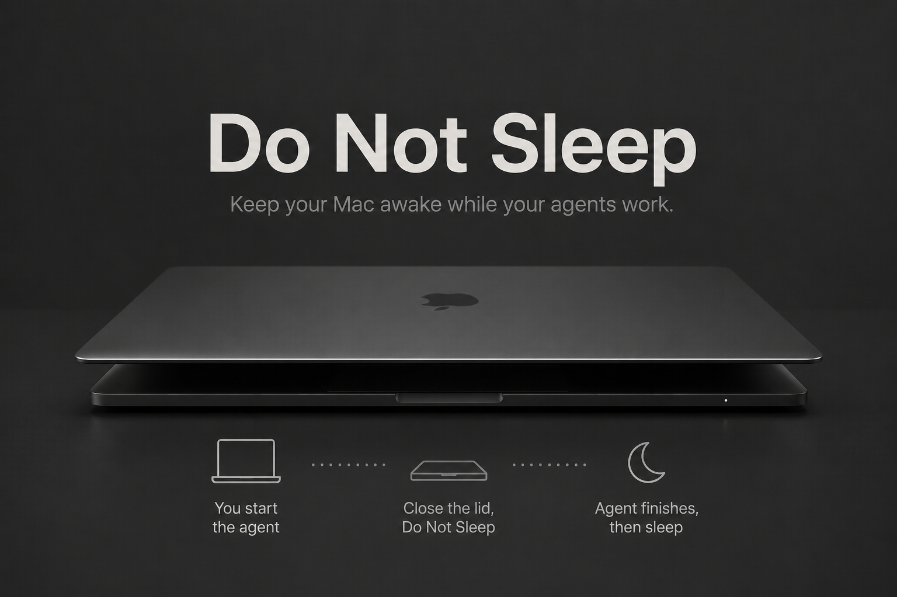

# Do Not Sleep

<!-- GitHub 저장소 경로가 바뀌면 아래 badge URL의 MayoneJY/Do-Not-Sleep만 바꾸면 됩니다. -->
<p align="center">
  <a href="Scripts/build-app.sh"></a>
  <a href="https://github.com/MayoneJY/Do-Not-Sleep/releases"></a>
  <a href="Scripts/build-app.sh"></a>
  <a href="Package.swift"></a>
  <a href="Sources/do-not-sleep/Resources"></a>
</p>

[English README](README.md)

Do Not Sleep은 Codex 같은 코딩 에이전트가 작업 중일 때 Mac이 잠자기로 들어가지 않도록 유지하는 macOS 메뉴 막대 앱입니다.

일반 유휴/디스플레이 잠자기 방지는 IOKit power assertion으로 처리합니다. 덮개를 닫은 상태에서도 버티려면 macOS 전역 설정인 `pmset disablesleep`이 필요하기 때문에, 이 경우에는 별도의 관리자 권한 helper를 사용합니다. 현재 구현과 검증은 Codex 워크플로우를 중심으로 맞춰져 있습니다. Claude Code 훅도 같은 로컬 훅 수신 경로로 설치되지만, 실제 장시간 사용 검증은 더 필요합니다.

## 기능

- 가벼운 macOS 메뉴 막대 앱으로 실행됩니다.
- 로컬 훅 수신 주소 `http://127.0.0.1:17643/event`를 엽니다.
- 수동 유지가 켜져 있거나 훅 세션이 남아 있으면 잠자기 방지를 유지합니다.
- 여러 훅 세션을 따로 추적해서 한 세션의 완료 이벤트가 다른 활성 세션을 풀지 않게 합니다.
- Codex와 Claude Code 훅을 설치해 세션 이벤트를 로컬 수신기로 보냅니다.
- 기록된 transcript 파일이 10분 동안 바뀌지 않으면 오래된 훅 세션을 자동 정리합니다.
- 관리자 권한이 적용되어 있으면 root LaunchDaemon helper를 통해 덮개 닫힘 강제 방지를 적용합니다.
- 활성 조건이 사라지면 assertion과 `pmset disablesleep`을 즉시 해제합니다.
- 마지막 세션이 끝났을 때 이미 덮개가 닫혀 있으면 helper에 `pmset sleepnow` 실행을 요청합니다.

## 요구사항

- 생성된 `.app` 번들 실행 기준 macOS 13 이상
- Swift 6.2 또는 호환 가능한 Swift Package Manager toolchain
- 훅 전달용 `curl`

프로젝트 전용 환경 변수는 필요하지 않습니다. 앱 표시 문자열과 내부 명령 출력은 SwiftPM 리소스로 다국어 처리되어 있습니다. 현재 포함된 언어는 영어와 한국어입니다. 언어를 강제로 바꾸려면 `DO_NOT_SLEEP_LANG=<language-code>`를 사용할 수 있습니다.

## 빌드와 실행

앱 번들 빌드:

```bash
./Scripts/build-app.sh
```

메뉴 막대 앱 실행:

```bash
open "Do Not Sleep.app"
```

개발 중에는 인자 없이 Swift Package를 실행해도 같은 메뉴 막대 앱이 시작됩니다.

```bash
swift run do-not-sleep
```

생성된 앱 번들은 다음 실행 파일을 사용합니다.

```text
Do Not Sleep.app/Contents/MacOS/DoNotSleep
```

`Scripts/build-app.sh`는 release 실행 파일을 빌드하고, 다국어 리소스, 메뉴 막대 에셋, helper 설치/제거 스크립트를 앱 번들 안으로 복사합니다.

## 메뉴 막대 앱

상태 항목은 글자가 아니라 아이콘입니다. macOS 템플릿 초승달 glyph를 사용하므로 밝은/어두운 메뉴 막대 대비는 시스템이 처리하고, 작은 색상 점이 상태를 표시합니다.

- 초록 점: 잠자기 방지 활성
- 노란 점: 잠자기 방지 비활성
- 빨간 점: 최근 오류가 있거나, 덮개 닫힘 강제 방지가 켜져 있는데 관리자 권한이 적용되지 않음

메뉴는 일부러 필요한 항목만 남겼습니다.

- 현재 잠자기 방지 상태
- 관리자 권한 상태
- 잠자기 방지 수동 유지 토글
- 로그인 시 자동 실행 토글
- 업데이트 확인
- 훅 세션 개수와 정리 메뉴
- 관리자 권한 적용/갱신
- 관리자 권한 제거, helper가 있을 때만 표시
- 상태 새로고침
- 종료

아래 정책은 기본으로 항상 켜져 있고 메뉴 토글로 노출하지 않습니다.

- 덮개 닫힘 강제 방지
- 오래된 훅 세션 자동 정리

프로세스 이름 기반 에이전트 감지는 사용하지 않습니다.

설정 파일:

```text
~/.do-not-sleep/preferences.json
```

현재 기본값:

- 수동 유지: 꺼짐
- 덮개 닫힘 강제 방지: 켜짐
- 오래된 훅 세션 자동 정리: 켜짐
- 오래된 세션 기준: 600초

## 에이전트 훅

메뉴 막대 앱이 실행 중이면 로컬에서 다음 주소를 수신합니다.

```text
http://127.0.0.1:17643/event
```

처음 설정할 때는 메뉴의 `관리자 권한 적용/갱신`을 사용하세요. macOS 관리자 인증과 훅 설치가 진행되는 동안 메뉴에는 설정 진행 중 상태가 표시됩니다. helper 적용이 끝나면 앱이 Codex와 Claude Code 훅도 직접 등록합니다. Python은 필요하지 않습니다.

앱이 수정하는 파일:

- `~/.codex/hooks.json`
- `~/.claude/settings.json`

기존 파일은 쓰기 전에 `.before-do-not-sleep-YYYYMMDDHHMMSS` 접미사로 백업합니다.

Codex는 새 command hook을 직접 신뢰 처리해야 실행합니다. 훅 설치 후 앱이 안내 창을 띄웁니다. 안내 창의 Codex 버튼은 `/hooks`를 클립보드에 복사하고 Codex 앱을 엽니다. Codex에서 `/hooks`를 붙여넣거나 입력한 뒤 `Do Not Sleep 훅 등록 세션 동기화` command hook을 신뢰 처리하세요.

처리하는 이벤트:

- Codex: `UserPromptSubmit`, `PostToolUse`, `Stop`
- Claude Code: `SessionStart`, `SessionEnd`
- 서브에이전트: `SubagentStart`, `SubagentStop`

`UserPromptSubmit`, `SessionStart`, `SubagentStart`는 세션을 등록합니다. `PostToolUse`는 Codex 세션 활동 시간을 갱신합니다. `Stop`, `SessionEnd`, `SubagentStop`은 세션을 제거합니다.

오래된 세션 정리는 Stop 훅 누락, 앱 크래시, 중단된 실행을 대비한 보조 장치입니다. 세션에 읽을 수 있는 transcript 경로가 있고 그 transcript 파일이 기준 시간 동안 바뀌지 않았을 때만 제거합니다. transcript 정보가 없는 세션은 이 자동 transcript 검사로 제거하지 않습니다.

## 내부 명령

Do Not Sleep에는 작은 명령 인터페이스가 남아 있습니다. 같은 Swift 실행 파일을 개발 실행, 진단, 관리자 권한 helper LaunchDaemon에서 함께 사용하기 때문입니다. 일반 사용자는 메뉴 막대 앱만 쓰면 되고 이 명령을 알 필요가 없습니다.

개발 중 유용한 명령:

```bash
swift run do-not-sleep
swift run do-not-sleep status
```

내부 helper 모드는 root LaunchDaemon에서만 사용합니다.

```bash
do-not-sleep helper --config <path>
```

그 외 세션 명령은 개발/테스트용으로 남아 있지만, 권장 흐름은 메뉴 막대 앱과 Codex/Claude 훅입니다.

## 관리자 권한과 덮개 닫힘 강제 방지

일반 IOKit assertion만으로는 덮개 닫힘 상태를 보장할 수 없습니다. 덮개 닫힘 강제 방지에는 다음 설정을 사용합니다.

```bash
pmset -a disablesleep 1
```

이 설정은 프로세스별 assertion이 아니라 macOS 전역 전원 설정입니다. 그래서 Do Not Sleep은 이 모드에 관리자 권한 helper를 사용합니다.

앱 메뉴에서 한 번만 권한을 적용하면 됩니다.

1. `Do Not Sleep.app`을 엽니다.
2. `관리자 권한 적용/갱신`을 선택합니다.
3. macOS 관리자 인증을 완료합니다.

앱 메뉴를 사용하면 별도 터미널 설치 단계는 필요하지 않습니다. 개발이나 스크립트 설치가 필요하면 저장소에서 같은 helper를 설치할 수 있습니다.

```bash
./Scripts/install-helper.sh
```

helper가 설치하는 파일:

- `/Library/PrivilegedHelperTools/local.do-not-sleep.helper`
- `/Library/LaunchDaemons/local.do-not-sleep.helper.plist`
- `/Library/Application Support/Do Not Sleep/helper.json`
- `/var/run/do-not-sleep-helper-<uid>.sock`

LaunchDaemon은 같은 Swift 실행 파일을 helper 모드로 실행합니다.

```bash
/Library/PrivilegedHelperTools/local.do-not-sleep.helper helper --config "/Library/Application Support/Do Not Sleep/helper.json"
```

helper는 로컬 Unix socket으로 아래 명령만 받습니다.

- `enable`
- `disable`
- `status`
- `sleepnow-if-lid-closed`

helper가 실행하는 시스템 명령은 아래 네 가지뿐입니다.

```bash
/usr/bin/pmset -a disablesleep 1
/usr/bin/pmset -a disablesleep 0
/usr/sbin/ioreg -r -k AppleClamshellState -d 1
/usr/bin/pmset sleepnow
```

`pmset sleepnow`는 `ioreg`로 덮개가 이미 닫혀 있다고 확인된 경우에만 요청합니다.

helper가 있을 때는 앱 메뉴에서 관리자 권한을 제거할 수 있습니다. 저장소 스크립트로 제거하려면:

```bash
./Scripts/uninstall-helper.sh
```

크래시나 강제 종료 뒤 `SleepDisabled`가 켜진 채 남아 있으면 직접 복구하세요.

```bash
sudo pmset -a disablesleep 0
```

덮개 닫힘 강제 방지는 주의해서 사용해야 합니다. 특히 노트북을 가방이나 밀폐된 공간에 넣은 상태에서는 배터리 소모와 발열 위험이 커질 수 있습니다.

## 상태 파일

런타임 파일은 아래 디렉터리에 저장됩니다.

```text
~/.do-not-sleep/
```

주요 파일:

- `state.json`: 훅 세션, 메뉴 앱 PID, assertion 상태, 덮개 닫힘 적용 기록
- `state.lock`: 상태 파일 lock
- `preferences.json`: 메뉴 설정
- `preferences.lock`: 설정 파일 lock
- `watch.lock`: 개발 명령 모드의 내부 watcher lock
- `menu.lock`: 메뉴 앱 단일 실행 lock
- `watch.log`: 개발 명령 모드의 내부 watcher 로그

내부 `status` 명령은 기록된 watcher/menu PID가 더 이상 살아 있지 않으면 stale 기록을 정리합니다. 훅 세션마다 마지막 훅 갱신 시각과 transcript 활동/경로 상태도 가능한 범위에서 출력합니다.

## 검증

빌드:

```bash
swift build
```

앱 번들 빌드:

```bash
./Scripts/build-app.sh
```

선택적인 진단 상태 확인:

```bash
swift run do-not-sleep status
```

macOS assertion 확인:

```bash
pmset -g assertions | grep "Do Not Sleep"
```

현재 검증 상태:

- `swift build`: 통과
- `./Scripts/build-app.sh`: 통과
- 내부 status 명령: 확인됨
- Codex 훅 흐름: 실제 Codex 워크플로우에서 테스트됨
- Claude Code 훅 흐름: 구현됨, 추가 검증 필요
- 덮개 닫힘 상태에서 세션 종료 후 잠자기 전환: 로컬 상호작용 테스트 완료, 장시간 검증은 더 있으면 좋음
- 다른 macOS 장비에서 fresh install: 아직 완전 검증 전

## 배포

Mac App Store 밖에 공개 배포하려면 Developer ID 서명과 Apple notarization을 사용하는 것이 맞습니다. notarization 인증 정보는 한 번만 Keychain에 저장합니다.

```bash
xcrun notarytool store-credentials "do-not-sleep-notary" \
  --apple-id "APPLE_ID" \
  --team-id "TEAMID" \
  --password "APP_SPECIFIC_PASSWORD"
```

배포 산출물은 `dist/`에 만들면 됩니다. 로컬 배포 자동화는 `Scripts/release.local.sh`, `.release.local.env`처럼 깃에 올리지 않는 파일로 관리하세요. `dist/`, Apple ID 비밀번호, API key, notarization profile, export한 인증서는 커밋하지 마세요.

## 업데이트

`업데이트 확인...`은 아래 GitHub Release의 최신 버전을 확인합니다.

```text
https://github.com/MayoneJY/Do-Not-Sleep/releases
```

더 높은 tag가 있으면 설치 가능한 `.zip` 또는 `.dmg` release asset을 고르고, 파일을 내려받은 뒤 현재 앱을 종료하고 `Do Not Sleep.app`을 교체한 다음 다시 실행합니다.

Release asset 조건:

- release tag는 `CFBundleShortVersionString`보다 높아야 합니다. 예: `v0.1.1`
- release에는 `.zip` 또는 `.dmg` asset이 있어야 합니다.
- 패키지 안에는 `Do Not Sleep.app`이 들어 있어야 합니다.
- 현재 앱 위치에 사용자가 쓸 수 있어야 합니다. 관리자 승인이 필요한 위치에 설치되어 있으면 사용자 쓰기 가능한 위치로 옮기거나, 서명된 release를 macOS 일반 설치 흐름으로 설치하세요.

공개 배포에는 여전히 Developer ID 서명과 공증이 필요하지만, Apple Developer Program 가입 전에도 updater 코드 경로는 빌드하고 테스트할 수 있습니다.

## 자주 생기는 문제

- 메뉴 아이콘이 안 보임: macOS 메뉴 막대 오른쪽과 Hidden Bar/Bartender 같은 메뉴 막대 정리 앱을 확인하세요.
- 훅 수신기가 안 뜸: 메뉴 막대 앱을 실행하고 메뉴에 `http://127.0.0.1:17643/event`가 보이는지 확인하세요.
- Codex 훅이 실행되지 않음: Codex에서 `/hooks`를 열고 설치된 command hook을 신뢰 처리하세요.
- 작업을 멈췄는데 세션이 남음: Stop 훅이 전달되지 않았을 수 있습니다. transcript 정보가 있고 파일 변경이 멈췄다면 기본 자동 정리가 약 10분 뒤 제거합니다. 아니면 훅 세션 정리 메뉴에서 직접 제거하세요.
- 덮개 닫힘 강제 방지에 관리자 권한이 필요하다고 나옴: 메뉴에서 권한을 적용하거나 `./Scripts/install-helper.sh`를 실행하세요.
- 크래시 뒤 `SleepDisabled`가 켜진 채 남음: `sudo pmset -a disablesleep 0`을 실행하세요.
